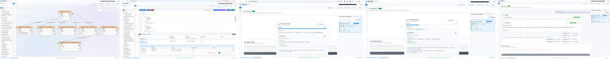
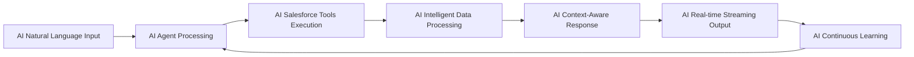

# DataPilot - The AI Revolution for Salesforce

<div align="center">

   

</div>

---

## **THE AI REVOLUTION FOR SALESFORCE IS HERE**

**Transform Salesforce from a complex database into an intelligent AI companion that understands, learns, and executes with unprecedented AI intelligence.**



**[Click here to view full-resolution features showcase](imgs/general/combined-features-optimized.png)**

*Experience the complete DataPilot AI platform in action*

---

## **REVOLUTIONARY AI INTELLIGENCE**

### **AUTONOMOUS AI AGENTS**
DataPilot features **100% custom-built agentic intelligence** that works independently, learns continuously, and delivers unprecedented Salesforce insights. This isn't just another AI tool—it's a **fully autonomous agentic intelligence** that revolutionizes how you interact with Salesforce data.

- **Custom ReAct Agent**: Revolutionary agentic intelligence specifically designed for Salesforce operations
- **Real-time AI Streaming**: Autonomous bidirectional streaming with intelligent chunked responses
- **Persistent AI Memory**: Sophisticated conversation state with MongoDB integration
- **5 Specialized AI Tools**: Autonomous Salesforce tools for comprehensive data operations
- **Revolutionary AI Breakthrough**: Fully autonomous agentic intelligence that works independently

### **AI CAPABILITIES THAT REVOLUTIONIZE SALESFORCE**
- **Natural Language Processing** - Convert human language to complex SOQL queries instantly
- **AI-Powered Query Optimization** - Intelligent performance suggestions and caching
- **AI-Enhanced Security** - Military-grade encryption with AI monitoring
- **AI Multi-Language Support** - Real-time translation and localization
- **AI Analytics & Insights** - Continuous learning and predictive analytics

### **NATURAL LANGUAGE TO AI INTELLIGENCE**
```
"Show me all high-value customers from last quarter" 
    ↓ AI Processing ↓
Intelligent SOQL Query + AI Performance Optimization + Real-time AI Results
```
---

## **CORE AI-INFUSED FEATURES**

> **Click on any feature below to explore detailed documentation and capabilities**

---

### **1. [AI-Powered Query Assistant](docs/01-ai-powered-query-assistant.md)**
**THE REVOLUTIONARY AI AGENTIC INTELLIGENCE**

> **This is DataPilot's CROWN JEWEL - The most advanced AI assistant ever built for Salesforce**

- **100% Custom AI ReAct Agent**: Revolutionary agentic intelligence
- **Real-time AI Streaming**: Live AI responses with intelligent chunked delivery
- **Persistent AI Memory**: Sophisticated AI conversation state management
- **5 Specialized AI Salesforce Tools**: Autonomous AI data operations
- **AI Data Redaction Strategy**: Optimized LLM token usage with full AI data security
- **Revolutionary AI Breakthrough**: Fully autonomous agentic intelligence

**Why it's AI REVOLUTIONARY:**
- AI converts natural language to complex SOQL queries instantly
- AI learns from your patterns and improves continuously
- AI provides context-aware business insights
- AI works autonomously without human intervention

---

### **2. [Interactive Schema Explorer](docs/02-interactive-schema-explorer.md)**
**AI-POWERED VISUAL INTELLIGENCE FOR SALESFORCE METADATA**

- **AI Smart Schema Discovery**: AI-powered metadata exploration
- **AI Intelligent Relationship Mapping**: Visual AI relationship intelligence
- **AI Dynamic Schema Visualization**: Interactive AI canvas with real-time updates
- **AI Performance-Optimized Caching**: AI smart caching for instant access
- **AI Drag-and-Drop Intelligence**: Seamless AI integration with query editor

---

### **3. [Advanced SOQL Query Editor](docs/03-advanced-soql-query-editor.md)**
**AI-INFUSED INTELLIGENT CODE EDITOR**

- **AI 6-Level Context-Aware Autocomplete**: AI SObject, field, relationship, keyword, function, nesting
- **AI Professional Code Formatting**: AI-powered query optimization
- **AI Bidirectional Integration**: Seamless AI schema canvas integration
- **AI Multi-Hierarchy Results**: Advanced AI result visualization with 4-level nesting
- **AI Real-time Validation**: Instant AI error detection and correction
---


## **CUTTING-EDGE AI TECHNICAL ARCHITECTURE**

### **AI Engine Architecture**


### **AI Frontend Excellence**
- **AI React + TypeScript**: AI-powered modern, type-safe development
- **AI Vite Build System**: AI lightning-fast development
- **AI Mantine UI**: AI professional, accessible components
- **AI Real-time WebSockets**: AI live AI streaming

### **AI Backend Intelligence**
- **AI Python + FastAPI**: AI high-performance API framework
- **AI LangGraph Integration**: AI advanced AI workflow orchestration
- **AI MongoDB**: AI scalable, intelligent data persistence
- **AI OpenAI Integration**: AI cutting-edge language models

---

## **COMPLETE AI DOCUMENTATION SUITE**

### **AI Core Features**
- **[AI-Powered Query Assistant](docs/01-ai-powered-query-assistant.md)** - AI Revolutionary agentic intelligence
- **[Interactive Schema Explorer](docs/02-interactive-schema-explorer.md)** - AI Visual metadata intelligence
- **[Advanced SOQL Query Editor](docs/03-advanced-soql-query-editor.md)** - AI Intelligent code editor
- **[Enterprise Security & Connection Management](docs/04-enterprise-security-connection-management.md)** - AI Military-grade security
- **[Apex Code Management](docs/05-apex-code-management.md)** - AI Advanced development tools

---

## **GET STARTED WITH THE AI REVOLUTION**

### **AI Quick Start**


### **AI Advanced Configuration**
- **AI Enterprise Security**: AI Master key and AI encryption setup
- **AI Performance Tuning**: AI Caching and AI optimization
- **AI Integration Setup**: AI API and AI external system connections
- **AI Monitoring**: AI Performance and AI security monitoring

---

## **DEVELOPMENT DOCUMENTATION**
- **[Docker README](docker/README.md)** - Complete docker deployment guide
- **[Backend README](backend/README.md)** - Complete backend development guide
- **[Docker README](docker/README.md)** - Containerized deployment guide

---

## **THE AI REVOLUTION IS HERE**

<div align="left">

**DataPilot isn't just a tool—it's the AI future of Salesforce data management.**

**Where AI natural language replaces AI complex queries.**

**Where AI autonomous agents handle your AI data operations.**

---

## **LICENSE**

This project is licensed under the DataPilot License - see the [LICENSE](../LICENSE) file for details.

**Commercial and Enterprise Use**: Requires prior written permission. Contact: [https://www.linkedin.com/in/bassem-elsodany/](https://www.linkedin.com/in/bassem-elsodany/)

---

<div align="left">

**THE AI FUTURE OF SALESFORCE IS HERE**

*Transform your Salesforce experience with AI revolutionary AI intelligence, AI autonomous agents, and AI enterprise-grade security.*

</div>