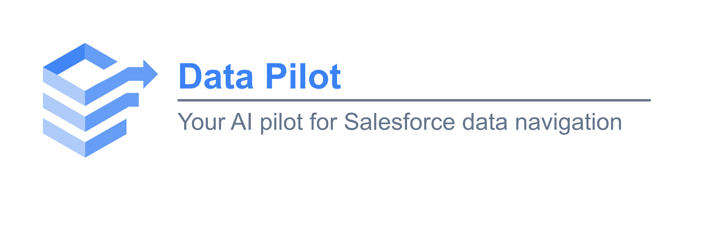
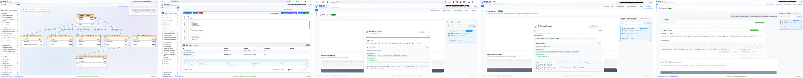
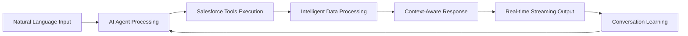

# DataPilot - Advanced Salesforce Data Platform

  
  
  

---

## **ADVANCED SALESFORCE DATA PLATFORM**

**Transform Salesforce data interaction with AI-infused intelligent query assistance, visual schema exploration, and advanced SOQL development.**

**[Click here to view full-resolution features showcase](imgs/general/combined-features-optimized.png)**

*Experience the complete DataPilot AI platform in action*

---

## **CORE FEATURES**

> **Click on any feature below to explore detailed documentation and capabilities**

---

### **1. [AI-Powered Query Assistant](docs/01-ai-powered-query-assistant.md)**
**INTELLIGENT NATURAL LANGUAGE TO SOQL CONVERSION**

> **DataPilot's flagship AI feature - Advanced natural language processing for Salesforce queries**

#### **AI Assistant in Action**

- **Custom ReAct Agent**: LangGraph-based agent for Salesforce operations
- **Real-time Streaming**: Live responses with intelligent chunked delivery
- **Persistent Conversation Memory**: Conversation state management with MongoDB
- **4 Specialized Salesforce Tools**: Object search, metadata, relationships, and query execution
- **Data Redaction Strategy**: Optimized LLM token usage with complete data security
- **Multi-turn Conversations**: Context-aware follow-up interactions

**Key Capabilities:**
- Converts natural language to complex SOQL queries
- Maintains conversation context across interactions
- Provides intelligent query suggestions
- Streams responses in real-time for better user experience

**Supported Use Cases:**
- **Object Discovery**: "Find all objects related to customer data"
- **Field Exploration**: "What fields are available on the Account object?"
- **Relationship Mapping**: "How are Account and Contact objects related?"
- **Data Queries**: "Show me all opportunities closing this month"
- **Complex Queries**: "Get accounts with their related contacts and opportunities"
- **Field Details**: "What are the picklist values for the Status field on Case?"
- **Multi-turn Conversations**: Build complex queries through iterative refinement

---

### **2. [Interactive Schema Explorer](docs/02-interactive-schema-explorer.md)**
**VISUAL SCHEMA EXPLORATION FOR SALESFORCE METADATA**

#### **Tree Navigation Interface**

#### **Canvas Visualization Interface**

- **Hierarchical Tree Navigation**: Expandable tree view of Salesforce objects and fields
- **Visual Canvas Interface**: Interactive drag-and-drop schema visualization
- **Smart Relationship Mapping**: Visual relationship intelligence and navigation
- **Performance-Optimized Caching**: Intelligent caching for instant access
- **Drag-and-Drop Integration**: Seamless integration with query editor

---

### **3. [Advanced SOQL Query Editor](docs/03-advanced-soql-query-editor.md)**
**INTELLIGENT SOQL DEVELOPMENT ENVIRONMENT**

#### **SOQL Editor Features**

- **6-Level Context-Aware Autocomplete**: SObject, field, relationship, keyword, function, nesting
- **Professional Code Formatting**: Advanced query formatting
- **Bidirectional Integration**: Seamless schema canvas integration
- **Multi-Hierarchy Results**: Advanced result visualization with 4-level nesting
- **Real-time Validation**: Instant error detection and correction
---

## **TECHNICAL ARCHITECTURE**

### **AI Engine Architecture**

### **Frontend Technology**
- **React + TypeScript**: Modern, type-safe development
- **Vite Build System**: Lightning-fast development
- **Mantine UI**: Professional, accessible components
- **Real-time WebSockets**: Live streaming communication

### **Backend Technology**
- **Python + FastAPI**: High-performance API framework
- **LangGraph Integration**: Advanced AI workflow orchestration
- **MongoDB**: Scalable data persistence
- **OpenAI Integration**: Cutting-edge language models

---

## **COMPLETE DOCUMENTATION SUITE**

### **Core Features**
- **[AI-Powered Query Assistant](docs/01-ai-powered-query-assistant.md)** - Natural language to SOQL conversion
- **[Interactive Schema Explorer](docs/02-interactive-schema-explorer.md)** - Visual metadata exploration
- **[Advanced SOQL Query Editor](docs/03-advanced-soql-query-editor.md)** - Intelligent code editor
- **[Apex Code Management](docs/05-apex-code-management.md)** - Apex development tools (Under Development)

---

## **GET STARTED WITH DATAPILOT**

### **Quick Start**
- Clone the repository and follow the setup instructions
- **Backend Setup**: Follow the [Backend README](backend/README.md) for Python/FastAPI setup
- **Frontend Setup**: Follow the [Frontend README](dashboard/README.md) for React/TypeScript setup
- **Docker Deployment**: Use the [Docker README](docker/README.md) for containerized deployment
- Configure your Salesforce connection
- Start using the AI-powered query assistant

### **Advanced Configuration**
- **Integration Setup**: API and external system connections
- **Monitoring**: Usage monitoring

---

## **DEPLOYMENT & DEVELOPMENT DOCUMENTATION**
- **[Docker README](docker/README.md)** - Complete docker deployment guide
- **[Backend README](backend/README.md)** - Complete backend development guide
- **[Frontend README](dashboard/README.md)** - Complete frontend development guide

---

## **ROADMAP**

### **🚀 Planned Features**

#### **Apex Development Tools**
- **Apex Code Management**: Basic Apex development environment
- **Apex Testing**: Simple test execution capabilities

#### **Enhanced Authentication**
- **Salesforce Web-based Authentication**: Native Salesforce OAuth integration
- **Multi-tenant Support**: Support for multiple Salesforce orgs

#### **Data Modification Capabilities**
- **Data Update Operations**: Basic insert, update, delete operations through UI
- **AI-Powered Data Updates**: Natural language data modification through AI agent
- **Data Validation**: Simple data validation and error handling

---

## **LICENSE**

This project is licensed under the DataPilot License - see the [LICENSE](../LICENSE) file for details.

**Commercial and Enterprise Use**: Requires prior written permission. Contact: [https://www.linkedin.com/in/bassem-elsodany/](https://www.linkedin.com/in/bassem-elsodany/)

---

**ADVANCED SALESFORCE DATA PLATFORM**

*Transform your Salesforce experience with intelligent query assistance, visual schema exploration, and advanced SOQL development.*

