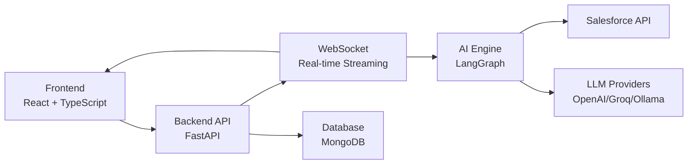
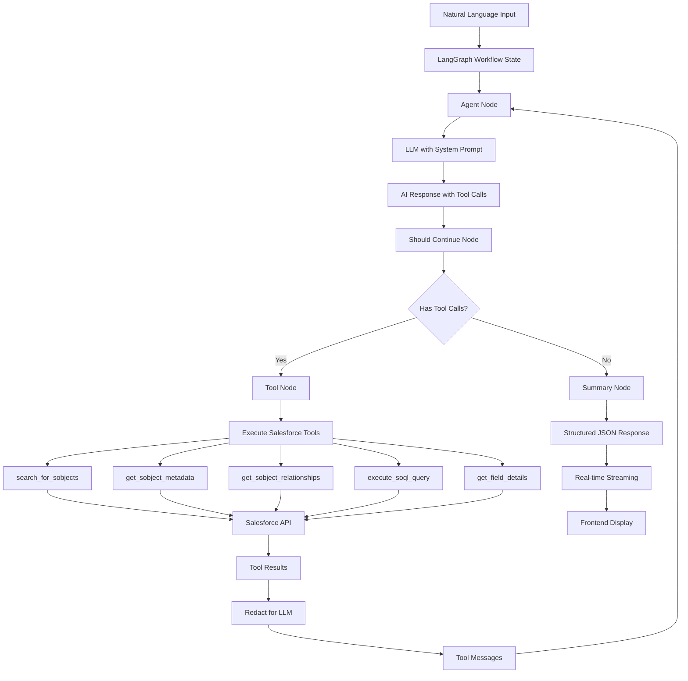

# 🚀 DataPilot Backend - AI-Powered Salesforce Platform

<div align="center">

   

---

## 🌟 **THE AI REVOLUTION FOR SALESFORCE BACKEND** 🌟

**Transform Salesforce operations with AI-powered backend intelligence, autonomous agents, and enterprise-grade security.**

</div>

---

## 📋 **Table of Contents**

### **🏗️ Architecture**
- [Architecture Overview](#architecture-overview)
- [High-Level Architecture](#high-level-architecture)
- [AI Engine Architecture](#ai-engine-architecture)

### **🚀 Getting Started**
- [Quick Start](#quick-start)
- [Prerequisites](#prerequisites)
- [Installation & Setup](#installation--setup)
- [Alternative Startup Methods](#alternative-startup-methods)

### **📡 API Reference**
- [API Endpoints Overview](#api-endpoints-overview)
- [Core Services](#core-services)
- [AI & Intelligence](#ai--intelligence)
- [Security & Authentication](#security--authentication)
- [Data Operations](#data-operations)
- [Internationalization](#internationalization)
- [Monitoring & Logging](#monitoring--logging)

### **🛠️ Development**
- [Development Commands](#development-commands)
- [Installation & Dependencies](#installation--dependencies)

### **🧠 AI Capabilities**
- [Autonomous AI Agent](#autonomous-ai-agent)
- [AI Tools](#ai-tools)

### **📊 Monitoring & Observability**
- [Health Monitoring](#health-monitoring)
- [Logging & Debugging](#logging--debugging)

### **📚 API Documentation**
- [Interactive Documentation](#interactive-documentation)
- [API Examples](#api-examples)

---

---

## **ARCHITECTURE OVERVIEW**

### **Core Technologies**
- **FastAPI**: High-performance async web framework
- **MongoDB**: Document database for data persistence
- **LangGraph**: AI workflow orchestration
- **WebSocket**: Real-time AI streaming

### **AI Integration**
- **Custom ReAct Agent**: Autonomous AI reasoning and acting
- **LangGraph Workflows**: Stateful AI conversation management
- **Real-time Streaming**: Live AI responses via WebSocket
- **Natural Language Processing**: Convert queries to SOQL

### **Architecture Overview**

#### **High-Level Architecture**


#### **AI Engine Architecture**



---

## **QUICK START**

### **Prerequisites**
- Python 3.11+
- [uv](https://docs.astral.sh/uv/) package manager
- MongoDB (local or cloud)
- **Langfuse** (optional, for AI agent observability and monitoring)

### **Installation & Setup**

```bash
# 1. Install uv (if not already installed)
curl -LsSf https://astral.sh/uv/install.sh | sh

# 2. Clone and navigate to backend
cd backend

# 3. Install dependencies
make install-dev

# 4. Configure environment
cp env.example .env
# Edit .env with your settings

# 5. Start the backend
make run
```

### **Alternative Startup Methods**

```bash
# Method 1: Using Makefile (Recommended)
make run                    # Development server with auto-reload
make run-prod              # Production server
make dev                   # Alias for run

# Method 2: Using start.sh script
./start.sh                 # Automated setup and startup

# Method 3: Direct uv command
uv run python -m uvicorn app.main:app --reload --host 0.0.0.0 --port 8000
```

---

## **API ENDPOINTS OVERVIEW**

### **Core Services**

| Service | Endpoint | Description | Model |
|---------|----------|-------------|-------|
| **Health** | `GET /api/v1/health` | System health and status | `HealthResponse` |
| **Salesforce** | `/api/v1/salesforce/*` | SOQL queries, SObjects, Apex execution | `QueryResponse`, `SObjectMetadata` |
| **Connections** | `/api/v1/connections/*` | Secure connection management | `ConnectionResponse`, `ConnectionCreate` |
| **AI Agents** | `/api/v1/ai-agents/*` | AI conversation and workflows | `AIQueryRequest`, `AIQueryResponse` |
| **Master Key** | `/api/v1/master-key/*` | Security and encryption | `MasterKeyResponse`, `MasterKeyCreate` |

### **AI & Intelligence**

| Endpoint | Method | Capability | Model |
|----------|--------|------------|-------|
| `/ai-agents/{conversation_uuid}` | POST | Natural language to SOQL conversion | `AIQueryRequest`, `AIQueryResponse` |
| `/ai-agents/{conversation_uuid}/stream` | WebSocket | Real-time AI streaming | `StreamingResponse` |
| `/ai-agents/conversations` | GET/POST | Conversation management | `ConversationResponse`, `ConversationCreate` |
| `/ai-agents/conversations/{uuid}` | GET/PUT/DELETE | Individual conversation operations | `ConversationResponse`, `ConversationUpdate` |

### **Security & Authentication**

| Endpoint | Method | Capability | Model |
|----------|--------|------------|-------|
| `/master-key/` | GET/POST/DELETE | Master key management | `MasterKeyResponse`, `MasterKeyCreate` |
| `/connections/` | GET/POST | Connection lifecycle | `ConnectionResponse`, `ConnectionCreate` |
| `/connections/{uuid}` | GET/PUT/DELETE | Individual connection operations | `ConnectionResponse`, `ConnectionUpdate` |
| `/auth-providers/` | GET/POST | Authentication providers | `AuthProviderResponse`, `AuthProviderCreate` |

### **Data Operations**

| Endpoint | Method | Capability | Model |
|----------|--------|------------|-------|
| `/salesforce/queries/execute` | POST | SOQL query execution | `QueryRequest`, `QueryResponse` |
| `/salesforce/sobjects/list` | GET | SObject discovery | `SObjectListResponse` |
| `/salesforce/sobjects/describe/{name}` | GET | SObject metadata | `SObjectMetadata` |
| `/salesforce/apex/execute-anonymous` | POST | Apex code execution | `ApexExecuteRequest`, `ApexExecuteResponse` |
| `/saved-queries/` | GET/POST | Query management | `SavedQueryResponse`, `SavedQueryCreate` |
| `/saved-apex/` | GET/POST | Apex code management | `SavedApexResponse`, `SavedApexCreate` |

### **Internationalization**

| Endpoint | Method | Capability | Model |
|----------|--------|------------|-------|
| `/i18n/translations/{lang}` | GET | Get translations | `TranslationResponse` |
| `/i18n/languages` | GET | Available languages | `LanguageResponse` |
| `/i18n/languages` | POST | Add new language | `LanguageCreate`, `LanguageResponse` |

### **Monitoring & Logging**

| Endpoint | Method | Capability | Model |
|----------|--------|------------|-------|
| `/logging/` | GET/POST | Log management | `LogResponse`, `LogCreate` |
| `/settings/` | GET/PUT | Application settings | `SettingsResponse`, `SettingsUpdate` |
| `/sobjects/cache` | GET | Cache statistics | `CacheStatsResponse` |

---

## **DEVELOPMENT COMMANDS**

### **Installation & Dependencies**
```bash
make install          # Production dependencies
make install-dev      # All dependencies (including dev)
make sync             # Sync from lock file
make update           # Update all dependencies
```


### **MongoDB Setup**
```bash
# Start MongoDB
mongod --dbpath /path/to/data

# Or use Docker
docker run -d -p 27017:27017 --name mongodb mongo:latest
```

---

## **AI CAPABILITIES**

### **Autonomous AI Agent**
- **ReAct Pattern**: Reasoning + Acting for complex operations
- **Natural Language Processing**: Convert queries to SOQL
- **Real-time Streaming**: Live AI responses via WebSocket
- **Context Awareness**: Maintains conversation state
- **Tool Integration**: 5 specialized Salesforce tools

### **AI Tools**
1. **search_for_sobjects**: SObject discovery and search
2. **get_sobject_metadata**: Detailed SObject information
3. **get_sobject_relationships**: Relationship mapping
4. **execute_soql_query**: Query execution and optimization
5. **get_field_details**: Field-level metadata and validation
---

## **MONITORING & OBSERVABILITY**

### **Health Monitoring**
- **System Health**: `/api/v1/health` endpoint
- **Service Status**: Real-time availability monitoring
- **Error Tracking**: Comprehensive error logging

### **Logging & Debugging**
- **Structured Logging**: JSON-formatted logs
- **Error Reporting**: Detailed error information
---

## **API DOCUMENTATION**

### **Interactive Documentation**
- **Swagger UI**: `http://localhost:8000/docs`
- **ReDoc**: `http://localhost:8000/redoc`
- **OpenAPI Schema**: `http://localhost:8000/openapi.json`

### **API Examples**
```bash
# Health check
curl http://localhost:8000/api/v1/health

# List SObjects
curl http://localhost:8000/api/v1/salesforce/sobjects/list

# Execute SOQL
curl -X POST http://localhost:8000/api/v1/salesforce/queries/execute \
  -H "Content-Type: application/json" \
  -d '{"query": "SELECT Id, Name FROM Account LIMIT 5"}'
```

---

## **LICENSE**

This project is licensed under the DataPilot License - see the [LICENSE](../LICENSE) file for details.

**Commercial and Enterprise Use**: Requires prior written permission. Contact: [https://www.linkedin.com/in/bassem-elsodany/](https://www.linkedin.com/in/bassem-elsodany/)

---

<div align="center">

## 🚀 **GET STARTED NOW**

**Ready to revolutionize your Salesforce operations with AI?**

```bash
# Quick start
make install-dev && make run
```

**🌐 Backend running at: http://localhost:8000**  
**📚 API Documentation: http://localhost:8000/docs**

---

**🤖 THE AI REVOLUTION FOR SALESFORCE BACKEND IS HERE 🤖**

*Transform your Salesforce operations with AI-powered intelligence, autonomous agents, and enterprise-grade security.*

</div>
