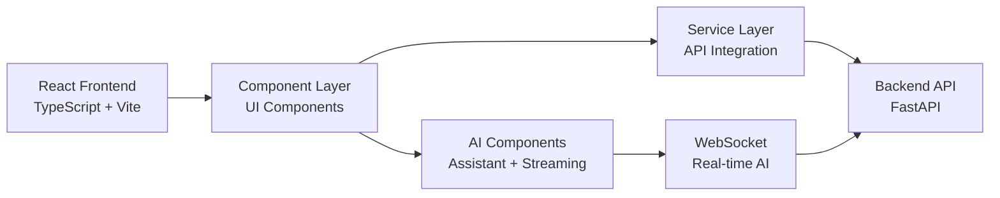
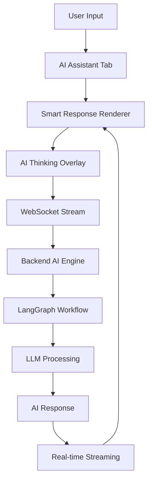

# 🎨 DataPilot Dashboard - AI-Powered Frontend Platform

<div align="center">

   

---

## 🌟 **THE AI REVOLUTION FOR SALESFORCE FRONTEND** 🌟

**Transform Salesforce operations with AI-powered frontend intelligence, autonomous agents, and enterprise-grade user experience.**

</div>

---

## 📋 **Table of Contents**

### **🏗️ Architecture**
- [Architecture Overview](#architecture-overview)
- [High-Level Architecture](#high-level-architecture)
- [AI Integration Architecture](#ai-integration-architecture)

### **🚀 Getting Started**
- [Quick Start](#quick-start)
- [Prerequisites](#prerequisites)
- [Installation & Setup](#installation--setup)
- [Alternative Startup Methods](#alternative-startup-methods)

### **📡 Component Reference**
- [Core Components](#core-components)
- [AI Components](#ai-components)
- [Query Editor Components](#query-editor-components)
- [UI Components](#ui-components)
- [Service Layer](#service-layer)

### **🛠️ Development**
- [Development Commands](#development-commands)
- [Installation & Dependencies](#installation--dependencies)

### **🧠 AI Capabilities**
- [AI Assistant Integration](#ai-assistant-integration)
- [AI Components](#ai-components)

### **📊 Performance & Monitoring**
- [Performance Optimization](#performance-optimization)
- [Debugging & Development](#debugging--development)

### **📚 Documentation**
- [Component Documentation](#component-documentation)
- [API Integration](#api-integration)

---

## **ARCHITECTURE OVERVIEW**

### **Core Technologies**
- **React 18**: Modern functional components with hooks
- **TypeScript**: Type-safe development with strict typing
- **Vite**: Lightning-fast build system and development server
- **Mantine**: Professional UI component library

### **AI Integration**
- **AI Assistant Tab**: Real-time AI conversation interface
- **Smart Response Renderer**: Dynamic AI response visualization
- **AI Thinking Overlay**: Visual AI processing indicators
- **WebSocket Integration**: Real-time AI streaming

### **Architecture Overview**

#### **High-Level Architecture**


#### **AI Integration Architecture**


---

## **QUICK START**

### **Prerequisites**
- **Node.js**: v18+ (LTS recommended)
- **npm**: v9+ or **yarn**: v1.22+
- **Backend Running**: DataPilot backend must be running
- **Browser**: Modern browser with ES6+ support

### **Installation & Setup**

#### **1. Install Dependencies**
```bash
# Install all dependencies
npm install

# Or using yarn
yarn install
```

#### **2. Environment Configuration**
```bash
# Copy environment template
cp env.example .env

# Configure environment variables
VITE_API_BASE_URL=http://localhost:8000
VITE_WS_BASE_URL=ws://localhost:8000
```

#### **3. Start Development Server**
```bash
# Start development server
npm run dev

# Or using yarn
yarn dev
```

### **Alternative Startup Methods**

#### **Production Build**
```bash
# Build for production
npm run build

# Preview production build
npm run preview
```

#### **Docker Development**
```bash
# Using Docker Compose (from project root)
docker-compose -f docker/docker-compose.dev.yml up dashboard
```

---

## **CORE COMPONENTS**

### **Application Structure**
| Component | Purpose | Key Features |
|-----------|---------|--------------|
| **App.tsx** | Main application orchestrator | State management, routing, layout |
| **AppHeader.tsx** | Application header | User info, settings, navigation |
| **StatusBar.tsx** | Application status | Connection status, notifications |
| **LoginPanel.tsx** | Authentication interface | Salesforce OAuth, connection management |

### **Query Editor Components**
| Component | Purpose | Key Features |
|-----------|---------|--------------|
| **QueryTab.tsx** | SOQL query editor | Monaco editor, autocomplete, validation |
| **SchemaTab.tsx** | Visual schema explorer | Interactive canvas, drag-and-drop |
| **AIAssistantTab.tsx** | AI conversation interface | Real-time streaming, smart responses |
| **SavedQueriesTab.tsx** | Query management | Save, load, organize queries |

### **AI Components**
| Component | Purpose | Key Features |
|-----------|---------|--------------|
| **AIThinkingOverlay.tsx** | AI processing visualization | Real-time thinking indicators |
| **SmartResponseRenderer.tsx** | Dynamic AI response display | Structured content rendering |
| **ConversationList.tsx** | AI conversation history | Chat interface, conversation management |

### **Service Layer**
| Service | Purpose | Key Features |
|---------|---------|--------------|
| **AIAgentService.ts** | AI integration | WebSocket communication, streaming |
| **SalesforceService.ts** | Salesforce API | SOQL execution, metadata access |
| **I18nService.ts** | Internationalization | Multi-language support, translations |
| **NotificationService.ts** | User notifications | Toast notifications, alerts |

---

## **DEVELOPMENT COMMANDS**

### **Installation & Dependencies**
```bash
# Install dependencies
npm install

# Install specific package
npm install <package-name>

# Update dependencies
npm update

# Check for outdated packages
npm outdated
```

### **Development Workflow**
```bash
# Start development server
npm run dev

# Build for production
npm run build

# Preview production build
npm run preview

# Type checking
npm run type-check

# Linting
npm run lint

# Lint and fix
npm run lint:fix
```

---

## **AI CAPABILITIES**

### **AI Assistant Integration**
- **Real-time Streaming**: Live AI responses via WebSocket
- **Smart Response Rendering**: Dynamic content visualization
- **Conversation Management**: Persistent chat history
- **Context Awareness**: Intelligent conversation context

### **AI Components**
- **AIThinkingOverlay**: Visual AI processing indicators
- **SmartResponseRenderer**: Structured AI response display
- **ConversationList**: Chat interface with history
- **AIThinkingOverlay**: Real-time processing visualization

---

## **PERFORMANCE & MONITORING**

### **Performance Optimization**
- **Code Splitting**: Lazy loading of components
- **Bundle Optimization**: Vite-based efficient builds
- **Memory Management**: Efficient state management
- **Caching**: Intelligent data caching strategies

---

## **COMPONENT DOCUMENTATION**

### **Core Application Components**
- **App.tsx**: Main application orchestrator with state management
- **AppHeader.tsx**: Application header with user controls
- **StatusBar.tsx**: Status indicators and notifications
- **LoginPanel.tsx**: Authentication and connection management

### **Query Editor Components**
- **QueryTab.tsx**: Advanced SOQL editor with Monaco integration
- **SchemaTab.tsx**: Visual schema explorer with interactive canvas
- **AIAssistantTab.tsx**: AI conversation interface with streaming
- **SavedQueriesTab.tsx**: Query management and organization

### **AI Integration Components**
- **AIThinkingOverlay.tsx**: Visual AI processing indicators
- **SmartResponseRenderer.tsx**: Dynamic AI response visualization
- **ConversationList.tsx**: Chat interface with conversation history
- **ConversationItem.tsx**: Individual conversation display

### **UI Components**
- **ResultsViewPage.tsx**: Query results display with advanced features
- **SchemaTree.tsx**: Interactive schema tree with drag-and-drop
- **MasterKeyManager.tsx**: Security key management interface
- **SavedConnectionsManager.tsx**: Connection management interface

---

## **API INTEGRATION**

### **Backend Communication**
- **REST API**: HTTP-based API communication
- **WebSocket**: Real-time AI streaming
- **Authentication**: Secure token-based authentication
- **Error Handling**: Comprehensive error management

### **Service Architecture**
- **ApiService.ts**: Core API communication layer
- **AIAgentService.ts**: AI-specific service integration
- **SalesforceService.ts**: Salesforce API integration
- **I18nService.ts**: Internationalization service

---

## **ENVIRONMENT VARIABLES**

### **Required Configuration**
```bash
# API Configuration
VITE_API_BASE_URL=http://localhost:8000
VITE_WS_BASE_URL=ws://localhost:8000
```

---

## **BUILD & DEPLOYMENT**

### **Development Build**
```bash
# Development server
npm run dev

# Build for development
npm run build:dev
```

### **Production Build**
```bash
# Production build
npm run build

# Preview production
npm run preview

# Analyze bundle
npm run analyze
```

### **Docker Deployment**
```bash
# Build Docker image
docker build -t datapilot-dashboard .

# Run container
docker run -p 3000:3000 datapilot-dashboard
```

---

## **TROUBLESHOOTING**

### **Common Issues**
- **Port Conflicts**: Ensure ports 3000 and 8000 are available
- **CORS Issues**: Verify backend CORS configuration
- **WebSocket Connection**: Check WebSocket URL configuration
- **Build Errors**: Clear node_modules and reinstall

### **Development Tips**
- **Hot Reload**: Changes reflect immediately in development
- **TypeScript**: Use strict typing for better development experience
- **Component Structure**: Follow React best practices
- **State Management**: Use React hooks for state management

---

## **LICENSE**

This project is licensed under the DataPilot License - see the [LICENSE](../LICENSE) file for details.

**Commercial and Enterprise Use**: Requires prior written permission. Contact: [https://www.linkedin.com/in/bassem-elsodany/](https://www.linkedin.com/in/bassem-elsodany/)
---

<div align="center">

**🎨 THE AI REVOLUTION FOR SALESFORCE FRONTEND IS HERE 🎨**

*Transform your Salesforce experience with AI-powered frontend intelligence, autonomous agents, and enterprise-grade user experience.*

</div>
