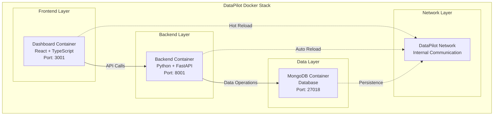

# 🐳 DataPilot Docker Deployment

<div align="center">

  

---

## 🚀 **REVOLUTIONARY AI PLATFORM - DOCKER DEPLOYMENT**

**Deploy DataPilot's revolutionary AI-powered Salesforce intelligence platform with enterprise-grade Docker containers.**

</div>

---

## 🏗️ **ARCHITECTURE**

### **📦 Container Architecture**


---

## ⚡ **QUICK START**

### **📋 Prerequisites**
- **Docker** and **Docker Compose** installed
- **Git** installed
- **Ports 3001, 8001, 27018** available

> **⚠️ Port Conflicts?** If ports are in use, you'll need to change them in the configuration files (see [Port Configuration](#port-configuration) section).

### **📥 1. Clone Repository**
```bash
# Clone DataPilot repository
git clone https://github.com/bassem-elsodany/datapilot.git
cd datapilot/docker

# Make start script executable
chmod +x start.sh
```

### **🔧 2. Configure Environment**

> **⚠️ IMPORTANT**: AI Agent features are **OPTIONAL**! 
> - **Without AI keys**: All tabs work normally except the AI Assistant tab
> - **With AI keys**: Full AI-powered query assistance and reasoning
> - **Other features**: Schema Explorer, Query Editor, Saved Queries work perfectly without AI

```bash
# Edit backend configuration
nano env/backend.env

# OPTIONAL: AI Agent Configuration (skip if you don't want AI features)
LLM_PROVIDER=openai                    # openai, groq, ollama
LLM_MODEL_NAME=gpt-4o-mini            # gpt-4o, gpt-4o-mini, llama-3.3-70b-versatile, qwen3:30b
LLM_API_KEY=sk-your-openai-api-key-here
LLM_TEMPERATURE=0.7
LLM_MAX_TOKENS=15000

# REQUIRED: Adjust logging level
LOG_LEVEL=INFO
```

```bash
# Edit frontend configuration  
nano env/dashboard.env

# REQUIRED: Set backend API URL
VITE_API_BASE_URL=http://localhost:8001

# For remote backend:
# VITE_API_BASE_URL=http://your-server-ip:8001
```

### **🚀 3. Start DataPilot**
```bash
# Production mode
./start.sh start

# Development mode (with hot reload)
./start.sh dev

# Stop application
./start.sh stop

# Reset all data and restart (DANGEROUS!)
./start.sh reset
```

### **🌐 4. Access Application**
- **Frontend**: http://localhost:3001
- **Backend**: http://localhost:8001  
- **API Docs**: http://localhost:8001/docs
- **Database**: localhost:27018 (MongoDB)

### **✅ 5. Verify Installation**
```bash
# Check all services are running
./start.sh status

# Test backend health
curl http://localhost:8001/api/v1/health

# Check logs if needed
./start.sh logs
```

---

## 🔧 **CONFIGURATION**

## **PORT CONFIGURATION**

If the default ports (3001, 8001, 27018) are already in use, you can change them:

### **📝 Step 1: Update Docker Compose**
```bash
# Edit docker-compose.yml
nano docker-compose.yml

# Change these lines:
ports:
  - "3002:80"     # Frontend: 3002 instead of 3001
  - "8002:8000"   # Backend: 8002 instead of 8001
  - "27019:27017" # MongoDB: 27019 instead of 27018
```

### **📝 Step 2: Update Frontend Configuration**
```bash
# Edit env/dashboard.env
nano env/dashboard.env

# Update API URL to match new backend port:
VITE_API_BASE_URL=http://localhost:8002
```

### **📝 Step 3: Update Backend Configuration**
```bash
# Edit env/backend.env
nano env/backend.env

# Update MongoDB connection:
MONGO_HOST=mongodb
MONGO_PORT=27017  # Keep internal port same
```

### **📝 Step 4: Restart Services**
```bash
# Stop and restart with new ports
./start.sh stop
./start.sh start
```

### **🌐 New Access URLs**
- **Frontend**: http://localhost:3002
- **Backend**: http://localhost:8002
- **API Docs**: http://localhost:8002/docs
- **Database**: localhost:27019

---

## 🤖 **AI MODEL CONFIGURATION**

DataPilot supports multiple AI providers and advanced reasoning models:

### **🚀 Supported Providers**
- **OpenAI**: GPT-4o, GPT-4o-mini, GPT-4-turbo
- **Groq**: Llama-3.3-70b-versatile, Mixtral-8x7b, Gemma-7b
- **Ollama**: Local models (Llama, Qwen, Mistral, etc.)

### **🧠 Advanced Reasoning Models**
```bash
# OpenAI Models
LLM_MODEL_NAME=gpt-4o                    # Most capable reasoning
LLM_MODEL_NAME=gpt-4o-mini              # Fast and efficient
LLM_MODEL_NAME=gpt-4-turbo              # Balanced performance

# Groq Models (Ultra-fast inference)
LLM_MODEL_NAME=llama-3.3-70b-versatile  # Advanced reasoning
LLM_MODEL_NAME=mixtral-8x7b-32768      # High performance
LLM_MODEL_NAME=gemma-7b-it              # Fast and capable

# Ollama Models (Local deployment)
LLM_MODEL_NAME=qwen3:30b                # Advanced Chinese/English
LLM_MODEL_NAME=llama3:70b               # Meta's latest
LLM_MODEL_NAME=mistral:7b              # Efficient reasoning
```

### **⚙️ Model Configuration**
```bash
# Temperature (0.0-1.0): Controls creativity vs consistency
LLM_TEMPERATURE=0.7                    # Balanced (recommended)
LLM_TEMPERATURE=0.3                    # More consistent
LLM_TEMPERATURE=0.9                    # More creative

# Max Tokens: Response length limit
LLM_MAX_TOKENS=15000                   # Long responses
LLM_MAX_TOKENS=4000                    # Shorter responses

# Timeout: Request timeout in seconds
LLM_TIMEOUT_SECONDS=60                 # Standard timeout
LLM_TIMEOUT_SECONDS=120                # For complex queries
```

---

## 🔧 **CONFIGURATION**

### **🔑 Backend Settings** (`env/backend.env`)
```bash
# AI Configuration (OPTIONAL - skip if you don't want AI features)
LLM_PROVIDER=openai                    # openai, groq, ollama
LLM_MODEL_NAME=gpt-4o-mini            # gpt-4o, gpt-4o-mini, llama-3.3-70b-versatile, qwen3:30b
LLM_API_KEY=sk-your-api-key-here     # Your API key
LLM_TEMPERATURE=0.7                   # 0.0-1.0 (creativity level)
LLM_MAX_TOKENS=15000                  # Maximum response length

# For Ollama (local models):
# LLM_BASE_URL=http://localhost:11434/v1

# Server Settings (REQUIRED)
HOST=0.0.0.0
PORT=8000
LOG_LEVEL=INFO                        # DEBUG, INFO, WARNING, ERROR
DEBUG=false
```

### **🌐 Frontend Settings** (`env/dashboard.env`)
```bash
# API Connection (REQUIRED)
VITE_API_BASE_URL=http://localhost:8001

# For different deployments:
# VITE_API_BASE_URL=http://your-server:8001
# VITE_API_BASE_URL=https://api.yourdomain.com

# Application Settings (OPTIONAL)
VITE_APP_NAME=DataPilot
VITE_DEFAULT_FONT_SIZE=medium
VITE_ENABLE_SEARCH=true
```

---

## 🛠️ **MANAGEMENT COMMANDS**

```bash
# Start commands
./start.sh start          # Production mode
./start.sh dev            # Development mode with hot reload

# Management commands  
./start.sh stop           # Stop all services
./start.sh restart        # Restart services
./start.sh status         # Show service status
./start.sh logs           # View all logs
./start.sh logs backend   # View backend logs
./start.sh cleanup        # Clean up resources
```

---

## 🔧 **TROUBLESHOOTING**

### **🚨 Common Issues**

#### **❌ "Permission Denied" Error**
```bash
# Fix: Make start script executable
chmod +x start.sh
```

#### **❌ "Docker Not Found" Error**
```bash
# Install Docker Desktop or Docker Engine
# macOS: https://docs.docker.com/desktop/mac/install/
# Linux: https://docs.docker.com/engine/install/
# Windows: https://docs.docker.com/desktop/windows/install/
```

#### **❌ "Port Already in Use" Error**
```bash
# Check what's using the ports
lsof -i :3001
lsof -i :8001
lsof -i :27018

# Option 1: Stop conflicting services
sudo kill -9 $(lsof -ti:3001)
sudo kill -9 $(lsof -ti:8001)
sudo kill -9 $(lsof -ti:27018)

# Option 2: Change ports (see Port Configuration section above)
# Edit docker-compose.yml and env files with new ports
```

#### **❌ "Container Won't Start" Error**
```bash
# Check Docker is running
docker info

# Check available disk space
df -h

# Check Docker logs
./start.sh logs
```

#### **AI Not Working**
```bash
# Check API key is set
docker-compose exec backend env | grep LLM_API_KEY

# Check backend logs
./start.sh logs backend
```

#### **Frontend Can't Connect to Backend**
```bash
# Check API URL setting
docker-compose exec dashboard env | grep VITE_API_BASE_URL

# Test backend connectivity
curl http://localhost:8001/api/v1/health
```

#### **Container Issues**
```bash
# View logs
./start.sh logs

# Restart services
./start.sh restart

# Rebuild containers
docker-compose down
docker-compose up --build -d
```

---

## 📋 **SERVICES**

| Service | Port | Technology | Description |
|---------|------|------------|-------------|
| **Frontend** | 3001 | React + TypeScript | User interface with hot reload |
| **Backend** | 8001 | Python + FastAPI | AI API with auto-reload |
| **Database** | 27018 | MongoDB 7.0 | Persistent data storage |

---

## **LICENSE**

This project is licensed under the DataPilot License - see the [LICENSE](../LICENSE) file for details.

**Commercial and Enterprise Use**: Requires prior written permission. Contact: [https://www.linkedin.com/in/bassem-elsodany/](https://www.linkedin.com/in/bassem-elsodany/)

---

<div align="center">

**🌟 DEPLOY THE REVOLUTIONARY AI PLATFORM 🌟**

*Transform your Salesforce experience with containerized AI intelligence*

[Quick Start](#quick-start) • [Configuration](#configuration) • [Troubleshooting](#troubleshooting)

</div>