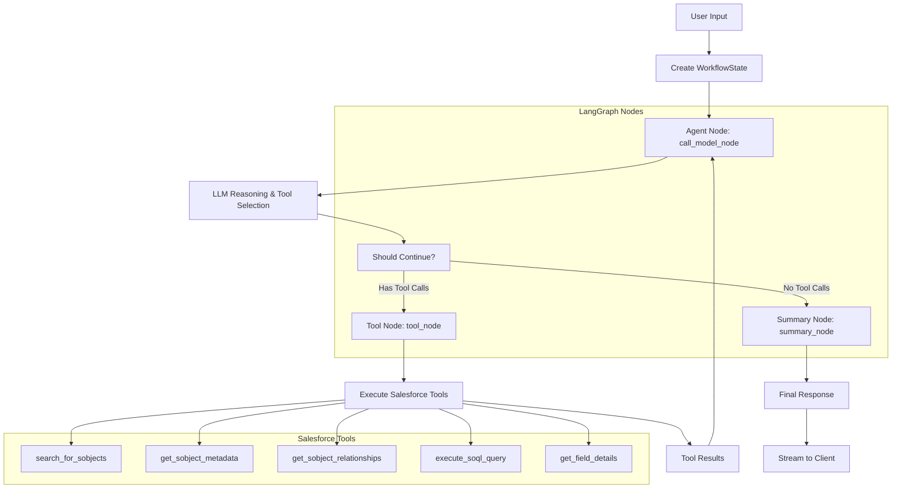
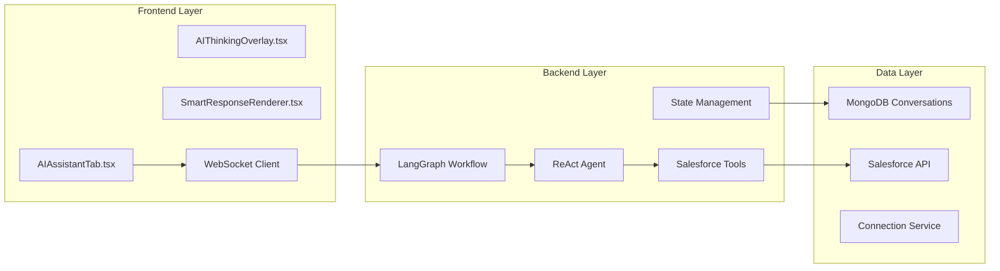
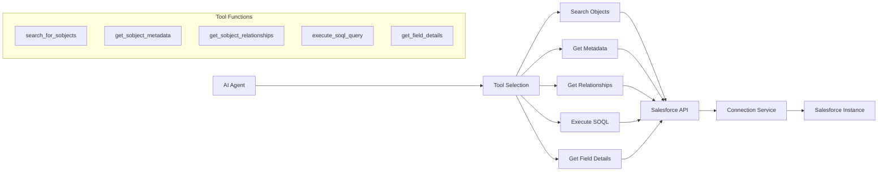
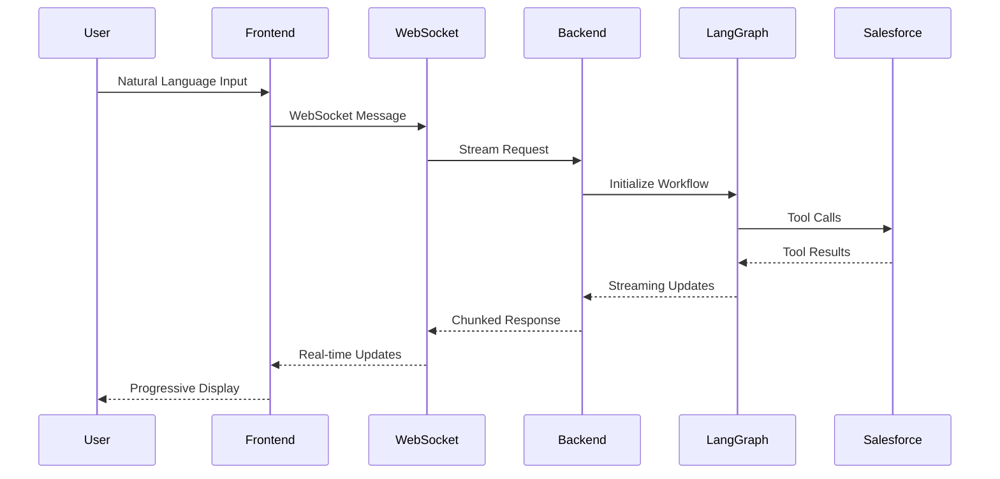
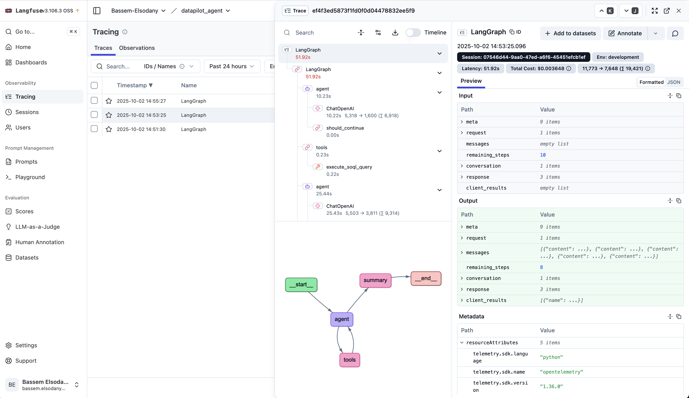

# AI-Powered Query Assistant

## Table of Contents

- [Overview](#overview)
- [Autonomous Agentic Intelligence: ReAct (Reasoning + Acting)](#autonomous-agentic-intelligence-react-reasoning--acting)
- [Live Demo](#live-demo)
- [Revolutionary Agentic Capabilities](#revolutionary-agentic-capabilities)
  - [Autonomous Natural Language Intelligence](#autonomous-natural-language-intelligence)
  - [Real-time Autonomous Processing](#real-time-autonomous-processing)
  - [Salesforce Autonomous Operations](#salesforce-autonomous-operations)
- [Technical Architecture](#technical-architecture)
  - [AI Workflow Engine (LangGraph ReAct Pattern)](#ai-workflow-engine-langgraph-react-pattern)
  - [Core Components Architecture](#core-components-architecture)
  - [Supported AI Models (Tested)](#supported-ai-models-tested)
- [Advanced Features](#advanced-features)
  - [Multi-turn Conversations](#1-multi-turn-conversations)
  - [Advanced Query Building](#2-advanced-query-building)
- [Performance Metrics](#performance-metrics)
  - [LLM Model Performance (Based on Temperature Settings)](#llm-model-performance-based-on-temperature-settings)
  - [Model-Specific Performance](#model-specific-performance)
  - [Performance Optimization Strategy](#performance-optimization-strategy)
  - [Network and Geographic Considerations](#network-and-geographic-considerations)
- [Integration Points](#integration-points)
- [Agent Observation & Monitoring](#agent-observation--monitoring)
  - [Langfuse Integration](#langfuse-integration)
  - [Configuration](#configuration)
  - [Observability Features](#observability-features)
  - [Benefits](#benefits)
- [Security Considerations](#security-considerations)
- [Best Practices](#best-practices)
- [Troubleshooting](#troubleshooting)

## Overview

The **AI-Powered Query Assistant** is DataPilot's revolutionary **Agentic Agent** that transforms Salesforce data interaction through autonomous artificial intelligence. This sophisticated agent understands natural language, autonomously discovers Salesforce objects, builds optimized SOQL queries, and delivers real-time streaming responses with complete business context awareness.

🚀 **Experience the Future of Salesforce Data Intelligence**

### Autonomous Agentic Intelligence: ReAct (Reasoning + Acting)

The **Agentic Agent** implements the cutting-edge **ReAct (Reasoning + Acting)** pattern, creating a truly autonomous AI that thinks, acts, and learns independently. This revolutionary approach enables the agent to:

🧠 **Think**: Autonomously analyze complex user requests and strategize optimal actions
⚡ **Act**: Execute sophisticated Salesforce operations using specialized AI tools
👁️ **Observe**: Intelligently process results and adapt strategies in real-time
🔄 **Iterate**: Continuously refine approaches until achieving perfect outcomes

**The Result**: A truly autonomous agent that works independently, learns from interactions, and delivers intelligent solutions without human intervention.

> **💡 Revolutionary Capability**: This isn't just an AI assistant—it's a fully autonomous agent that can independently discover, analyze, and solve complex Salesforce data challenges.

> **💡 Performance Optimization Note**: The ReAct prompt can be fine-tuned to achieve lower latency and reduced token usage. Experimenting with prompt engineering techniques such as:
> - **Shorter reasoning chains**: Reducing verbose explanations in the reasoning phase
> - **Tool selection optimization**: Streamlining tool selection logic
> - **Context compression**: Minimizing context while maintaining accuracy
> - **Response formatting**: Optimizing output structure for efficiency
> 
> These optimizations can significantly improve response times while maintaining the same level of accuracy and functionality.

## Live Demo


*Watch the AI Assistant in action: Natural language processing, real-time streaming responses, and intelligent Salesforce data operations.*

The demo showcases:
- **Natural Language Input**: Converting plain English to SOQL queries
- **Real-time AI Processing**: Dynamic tool selection and thinking process
- **Streaming Responses**: Progressive disclosure of AI reasoning and results
- **Structured Data Display**: Organized query results with metadata
- **Multi-turn Conversations**: Context-aware follow-up interactions

## Revolutionary Agentic Capabilities

### Autonomous Natural Language Intelligence
- **🤖 Self-Discovering Agent**: Automatically finds and maps Salesforce objects from natural language
- **🧠 Context-Aware Reasoning**: Maintains sophisticated conversation context across complex interactions
- **🎯 Intent Mastery**: Deeply understands user intent and business requirements autonomously
- **🔄 Self-Improving Intelligence**: Iteratively refines approaches based on results and feedback

### Real-time Autonomous Processing
- **🚀 Live Agentic Streaming**: Real-time autonomous response generation with intelligent reasoning
- **👁️ Progressive Intelligence**: Information revealed as the agent autonomously processes and reasons
- **🧠 Persistent Memory**: Maintains sophisticated conversation state and learning across sessions
- **🔄 Multi-turn Autonomy**: Complex multi-step query building with autonomous decision-making

### Salesforce Autonomous Operations
- **🔍 Intelligent Discovery**: Autonomous metadata exploration and object structure analysis
- **⚡ Smart Data Retrieval**: Autonomous SOQL query execution with intelligent optimization
- **🔗 Relationship Intelligence**: Autonomous mapping of object connections and dependencies
- **📊 Field Intelligence**: Autonomous analysis of field properties and business logic

### Revolutionary Agentic Architecture
- **🤖 Autonomous ReAct Agent**: 100% custom-built agentic intelligence specifically designed for DataPilot's Salesforce operations
- **⚡ Real-time Agentic Streaming**: Autonomous bidirectional streaming with intelligent chunked responses
- **🧠 Persistent Agentic Memory**: Sophisticated conversation state persistence with MongoDB integration
- **🛠️ Autonomous Salesforce Tools**: 5 specialized AI tools for comprehensive autonomous Salesforce operations
- **🧠 Intelligent State Management**: Advanced TypedDict-based state with autonomous conversation context awareness

> **🌟 Revolutionary Breakthrough**: This isn't just another AI tool—it's a fully autonomous agentic intelligence that works independently, learns continuously, and delivers unprecedented Salesforce data insights.

## Technical Architecture

### AI Workflow Engine (LangGraph ReAct Pattern)



### Core Components Architecture




### Salesforce Tools Integration



### WebSocket Streaming Architecture




### Deep Technical Implementation

#### Custom ReAct Agent Architecture
The AI agent implements a **100% custom-built ReAct (Reasoning + Acting)** pattern specifically designed for DataPilot's Salesforce operations:


**Custom Node Architecture:**
- **Custom Agent Node** (`call_model_node`): Custom LLM reasoning and tool selection logic
- **Custom Tool Node** (`tool_node`): Custom Salesforce API execution with DataPilot-specific logic
- **Custom Should Continue Node** (`should_continue`): Custom loop control logic for Salesforce operations
- **Custom Summary Node** (`summary_node`): Custom final response generation for DataPilot

#### Critical Data Optimization: LLM Token Reduction

**Data Redaction Strategy:**
The custom ReAct agent implements a sophisticated **data redaction system** to optimize LLM token usage while maintaining full functionality:

**How Data Redaction Works:**
The agent intelligently separates data into two streams: **reasoning data** for the LLM and **complete data** for the client. When Salesforce tools return large datasets, the agent automatically extracts only essential metadata (object names, record counts, query structure) for LLM reasoning while preserving the complete, unredacted data for user consumption.

**The Process:**
1. **Tool Execution**: Salesforce tools execute queries and return full results
2. **Intelligent Extraction**: Agent extracts metadata (counts, structure, field names) for LLM reasoning
3. **Data Separation**: Complete records are stored separately for client delivery
4. **LLM Processing**: LLM receives only metadata to reason about data structure and generate responses
5. **Client Delivery**: Users receive full, unredacted data with complete record details

**Smart Optimization:**
The agent never sends actual record data to the LLM, only structural information needed for reasoning. This allows the LLM to understand data patterns, generate appropriate responses, and provide intelligent suggestions while dramatically reducing token usage and processing costs.

**Token Optimization Benefits:**
- **90%+ Token Reduction**: LLM processes metadata only, not full record data
- **Maintained Functionality**: Agent can reason about data structure and generate responses
- **Full Client Data**: Users receive complete, unredacted results
- **Cost Efficiency**: Dramatically reduced LLM token usage for large datasets
- **Performance**: Faster LLM processing with metadata-only reasoning

**Context Summarization:**
The agent maintains sophisticated conversation context through intelligent summarization that captures four key dimensions of interaction history:

**Object Resolution Intelligence:**
The agent remembers discovered Salesforce objects, their API names, and how user terms map to actual object names. It also tracks discovered relationships between objects, including parent-child connections and lookup relationships, enabling seamless reference across conversation turns.

**Field Discovery Memory:**
The agent builds a comprehensive knowledge base of field information discovered during conversations, including field types, requirements, and business logic. This allows the agent to provide increasingly accurate field suggestions and avoid redundant metadata calls.

**Technical Context Learning:**
The agent learns from successful query patterns and failed attempts, building a knowledge base of what works and what doesn't. This enables the agent to suggest better approaches and avoid repeating unsuccessful patterns.

**Relationship Mapping Intelligence:**
The agent maintains detailed relationship maps between Salesforce objects, understanding how they connect and what relationship query names to use in SOQL subqueries. This enables complex multi-object queries with proper relationship traversal.

**Context Usage Patterns:**
- **Object Resolution**: Reuse discovered API names across conversation turns
- **Field Discovery**: Leverage known field types and requirements
- **Query Optimization**: Apply successful patterns, avoid failed ones
- **Relationship Mapping**: Use established relationship query names

#### Advanced Prompt Engineering

**System Prompt Architecture:**
The AI agent uses a sophisticated prompt system with:

**1. Intent Classification Rules:**
- **Metadata Query**: Object structure and field information
- **Data Query**: Actual record retrieval with SOQL
- **Relationship Query**: Object connections and dependencies
- **Field Details Query**: Specific field properties
- **Clarification Needed**: Out-of-scope or ambiguous requests

**2. Operation Workflow:**
```
THINK → ACT → OBSERVE → RESPOND
```

**3. Critical Rules:**
- **Never Fabricate Field Names**: Use only discovered field names
- **SOQL Only**: Generate Salesforce SOQL, not SQL
- **Action Bias**: Prefer action over clarification
- **Context First**: Check conversation history before acting


### Supported AI Models (Tested)
- **OpenAI**: GPT-5, GPT-4 for production-grade natural language processing
- **Groq**: High-performance inference with [developer rate limits](https://console.groq.com/docs/rate-limits) for fast response times
- **Local Ollama**: Qwen3 30B parameters for on-premises deployment and data privacy

*The AI agent has been thoroughly tested and validated with all three model providers to ensure consistent performance and reliability across different deployment scenarios.*

## Advanced Features

### 1. Multi-turn Conversations

#### Overview
The AI maintains conversation context across multiple interactions, enabling complex, multi-step query building.

#### Context Management
- **Conversation History**: Maintains conversation context in MongoDB
- **Object Resolution**: Remembers discovered object names across turns
- **State Persistence**: Saves conversation state across sessions
- **Context Switching**: Handles topic changes while preserving relevant context

#### Multi-turn Conversation Features (Shown in Demo)

The AI maintains rich conversation context:

- **Conversation History** with chat-style interface showing human and AI messages
- **Object Context** highlighting previously discovered objects and their relationships
- **Smart Resolution** reusing known object names and field information across turns
- **State Persistence** maintaining conversation context across browser sessions
- **Context-Aware Responses** building on previous interactions for complex queries

### 2. Advanced Query Building

#### Overview
The AI assistant can build complex queries through iterative refinement and multi-step construction.

#### Building Process
1. **Object Discovery**: AI searches for and discovers relevant Salesforce objects
2. **Field Discovery**: AI retrieves metadata to find real field names
3. **Relationship Mapping**: AI understands object connections for subqueries
4. **Query Construction**: AI builds SOQL with proper field names and relationships

#### Advanced Query Building Process (Demonstrated in GIF)

The AI builds complex queries through intelligent discovery:

- **Iterative Object Discovery** searching for and validating Salesforce objects
- **Field Metadata Retrieval** getting real API names and properties from Salesforce
- **Relationship Analysis** understanding object connections for subqueries
- **SOQL Construction** building proper queries with correct field names and relationships
- **Query Validation** ensuring syntax correctness and field availability

## Performance Metrics

### LLM Model Performance (Based on Temperature Settings)

#### Tool Selection & Query Processing (Temperature: 0.8)
- **Response Time**: 20-40 seconds for complex tool selections and SOQL generation
- **Accuracy**: High precision for tool selection and query construction
- **Reasoning Quality**: Enhanced creativity and problem-solving capabilities
- **Use Case**: Primary AI agent operations requiring accurate tool selection

#### Summary Generation (Temperature: 0.1)
- **Response Time**: 10 and 20 seconds for conversation summarization
- **Accuracy**: High consistency for structured JSON output
- **Reasoning Quality**: Focused, deterministic summarization
- **Use Case**: Background conversation context processing

### Model-Specific Performance

#### OpenAI Models
- **GPT-5**: Latest model with enhanced reasoning capabilities
- **GPT-4**: Production-grade performance with high accuracy
- **Temperature Impact**: Lower temp = faster, more consistent; Higher temp = more creative, slower

#### Groq Models
- **High-Performance Inference**: Optimized for speed with developer rate limits
- **Response Times**: 10-20 seconds for tool selection, faster for simple operations
- **Temperature Scaling**: Efficient performance across temperature ranges

#### Local Ollama (Qwen3 30B)
- **On-Premises Processing**: Complete data privacy and control
- **Temperature Flexibility**: Customizable for specific use cases
- **Resource Optimization**: Balanced performance for local deployment

### Performance Optimization Strategy
- **Tool Selection**: Higher temperature (0.8) for accurate tool selection and reasoning
- **Summary Processing**: Lower temperature (0.1) for consistent, structured output
- **Model Selection**: Choose based on speed vs. accuracy requirements
- **Temperature Tuning**: Balance between response time and output quality

### Network and Geographic Considerations
**Important Performance Factors:**
- **Network Latency**: Response times significantly affected by your network connection speed and stability
- **Geographic Location**: Distance from AI service providers impacts response times
  - **OpenAI**: Performance varies by region (US, EU, Asia-Pacific)
  - **Groq**: Regional data centers affect inference speed
  - **Local Ollama**: No network dependency, but limited by local hardware
- **Connection Quality**: Stable, high-speed internet recommended for optimal performance
- **Regional API Endpoints**: Choose closest geographic region for best performance

## Integration Points

### Salesforce API Integration
- **REST API**: Standard Salesforce REST API calls
- **Metadata API**: Schema and object information
- **SOQL Queries**: Data retrieval operations
- **Object Search**: SObject discovery and validation

### AI Services
- **LangGraph**: ReAct agent workflow orchestration
- **OpenAI Models**: GPT-5, GPT-4 for natural language processing (tested)
- **Groq Models**: High-performance inference with developer rate limits (tested)
- **Local Ollama**: Qwen3 30B parameters for on-premises deployment (tested)
- **Tool Integration**: Salesforce operation tools
- **MongoDB**: Conversation state persistence
- **Langfuse Integration**: Agent observation and tracing (configurable)

## Agent Observation & Monitoring

### Langfuse Integration
The AI agent includes comprehensive observation capabilities through Langfuse integration for monitoring, debugging, and optimization.

**Important Note**: This feature is **disabled by default** and requires manual setup. You must deploy the Langfuse component on your machine or use the cloud version to enable monitoring capabilities.

#### Configuration
- **Enable Tracing**: Set `LANGFUSE_ENABLE_TRACING=true` in environment variables
- **Deployment Required**: Must deploy Langfuse component locally or use cloud version
- **Project Tracking**: Automatic session and conversation tracking
- **Performance Monitoring**: Response times, token usage, and model performance
- **Debug Information**: Detailed workflow execution traces

#### Observability Features
- **Agent Workflow Tracking**: Complete LangGraph execution traces
- **Tool Usage Monitoring**: Salesforce API call tracking and performance
- **LLM Interaction Logging**: Request/response pairs with timing data
- **Error Tracking**: Detailed error logs and failure analysis
- **Token Usage Analytics**: Cost tracking and optimization insights

#### Screenshot: Langfuse Dashboard


The Langfuse dashboard shows your AI agent's execution in real-time:

- **Trace List**: Your recent AI conversations with timestamps
- **Execution Tree**: Shows the agent's thinking process (agent → tools → agent → summary)
- **Performance**: 51.92s total time, $0.003648 cost, 19,421 tokens used
- **Workflow Graph**: Visual flow of how the ReAct pattern works
- **Debug Data**: Complete input/output for troubleshooting

This gives you full visibility into how the AI processes your requests and where time/costs are spent.

#### Benefits
- **Performance Optimization**: Identify bottlenecks and optimization opportunities
- **Debug Capabilities**: Detailed traces for troubleshooting complex queries
- **Cost Management**: Monitor token usage across different models
- **Quality Assurance**: Track accuracy and response quality over time

## Security Considerations

### Data Privacy
- **Query Encryption**: All queries encrypted in transit
- **Audit Logging**: Complete query and response logging

### AI Security
- **Prompt Injection Prevention**: Input sanitization
- **Response Validation**: AI output verification
- **Context Isolation**: Secure conversation boundaries
- **Model Security**: Protected AI model access

## Best Practices

### Query Construction
1. **Use discovered object names** from AI search results
2. **Leverage real field names** from metadata operations
3. **Understand relationships** before building complex queries
4. **Follow SOQL best practices** for optimal performance

### Conversation Management
1. **Maintain clear context** in multi-turn conversations
2. **Reference discovered objects** from previous interactions
3. **Leverage AI suggestions** for query refinement
4. **Monitor conversation state** for optimal performance

### Error Handling
1. **Review AI suggestions** for error resolution
2. **Use alternative approaches** when primary methods fail
3. **Check object and field names** against metadata
4. **Report persistent issues** for system improvement

## Troubleshooting

### Common Issues
- **Slow Response Times**: Check network connectivity and server load
- **Context Loss**: Refresh conversation or restart AI session
- **Query Errors**: Review AI suggestions and try alternative approaches
- **Permission Issues**: Verify Salesforce access and API permissions
- **Langfuse Tracing Issues**: Verify `LANGFUSE_ENABLE_TRACING=true` and API keys are configured

### Performance Optimization
- **Clear conversation history** for better performance
- **Use specific object names** rather than generic terms
- **Leverage discovered metadata** for accurate field names
- **Monitor resource usage** for optimal performance

### AI Model Selection (Tested Models)

#### Production Recommendations
- **OpenAI GPT-5**: Latest model with enhanced reasoning for complex tool selection (temperature: 0.8)
- **OpenAI GPT-4**: Proven production model with high accuracy and reliability
- **Groq**: Optimal for high-throughput scenarios with fast inference and developer rate limits
- **Local Ollama Qwen3 30B**: Ideal for data-sensitive environments requiring on-premises processing

#### Temperature Configuration Strategy
- **Tool Selection & Query Processing**: Temperature 0.8 for enhanced creativity and accurate tool selection
- **Summary Generation**: Temperature 0.1 for consistent, structured JSON output
- **Model Flexibility**: Each model supports temperature tuning for specific use cases
- **Performance Trade-offs**: Higher temperature = more accurate but slower; Lower temperature = faster but less creative

---

*This documentation provides comprehensive guidance for using the AI-Powered Query Assistant feature, including technical details, best practices, and troubleshooting information.*
