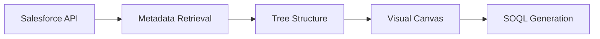

# Interactive Schema Explorer

## Table of Contents

- [Overview](#overview)
- [Technical Architecture](#technical-architecture)
  - [Schema Processing Pipeline](#schema-processing-pipeline)
  - [Core Components](#core-components)
- [SchemaTree Component](#schematree-component)
  - [Overview](#overview-1)
  - [How It Works](#how-it-works)
  - [Key Features](#key-features)
  - [Interface Elements](#interface-elements)
  - [Field Metadata Display](#field-metadata-display)
  - [Cache Management System](#cache-management-system)
  - [Demo](#demo)
- [SchemaTab Component](#schematab-component)
  - [Overview](#overview-2)
  - [How It Works](#how-it-works-1)
  - [Key Features](#key-features-1)
  - [Interface Elements](#interface-elements-1)
  - [Demo](#demo-1)
- [Integration Features](#integration-features)
  - [Query Editor Integration](#query-editor-integration)
  - [AI Assistant Integration](#ai-assistant-integration)
- [Performance Metrics](#performance-metrics)
- [Best Practices](#best-practices)
- [Troubleshooting](#troubleshooting)

## Overview

The Interactive Schema Explorer is DataPilot's schema navigation system that provides intuitive access to Salesforce metadata through a tree-based interface and visual canvas. This feature enables users to explore SObject structures, discover fields, and build queries through interactive exploration.

The system consists of two main components:
- **SchemaTree Component**: Hierarchical tree-based object and field navigation
- **SchemaTab Component**: Visual canvas interface for query building

## Technical Architecture

### Schema Processing Pipeline

### Core Components
- **SchemaTree Component**: Tree-based object and field navigation
- **SchemaTab Component**: Visual canvas for query building
- **Cache Service**: Intelligent metadata caching for performance
- **AST Integration**: Abstract Syntax Tree for SOQL generation

## SchemaTree Component

### Overview
The SchemaTree component provides a hierarchical tree view of Salesforce objects and their fields, enabling intuitive exploration of the Salesforce schema structure.

### How It Works
1. **Object Loading**: Retrieves SObject list from Salesforce API
2. **Tree Structure**: Builds expandable tree with objects as parent nodes
3. **Field Loading**: Loads fields on-demand when objects are expanded
4. **Caching**: Uses intelligent caching for performance optimization

### Key Features
- **Hierarchical Tree View**: Expandable/collapsible object and field nodes
- **Search Functionality**: Search across objects and fields by name or type
- **Filter Options**: Filter by All/Standard/Custom/Favorites
- **Favorites System**: Heart icon to bookmark frequently used objects
- **Field Metadata**: Shows field type, constraints, and picklist values
- **Loading States**: Visual indicators for expanding nodes
- **Error Handling**: Graceful error display for failed operations

### Interface Elements
- **Search Bar**: Real-time search with clear button
- **Filter Buttons**: All, Standard, Custom, Favorites filters
- **Tree Nodes**: Expandable objects with field children
- **Field Icons**: Visual indicators for different field types
- **Favorites Toggle**: Heart icon for adding/removing favorites
- **Cache Status**: Shows cache size and performance metrics

### Field Metadata Display

#### Field Information Display
- **Field Type Icons**: Visual indicators for different field types (string, number, date, etc.)
- **Field Constraints**: Shows required, custom, and reference field indicators
- **Picklist Values**: Tooltip display of picklist options with active/inactive status
- **Field Type Badges**: Color-coded badges for field types

#### Field Type Support
- **String/Textarea**: Text-based fields with emerald color coding
- **Number/Currency**: Numeric fields with blue color coding
- **Date/DateTime**: Date fields with violet color coding
- **Boolean**: Boolean fields with rose color coding
- **Picklist/Multipicklist**: Selection fields with fuchsia color coding
- **Email/Phone/URL**: Contact fields with cyan/sky/lime color coding
- **Reference**: Lookup fields with orange color coding
- **ID**: ID fields with red color coding

#### Advanced Features
- **Field Search**: Search across all objects and fields
- **Type Filtering**: Filter by field type in search results
- **Picklist Tooltips**: Hover to see picklist values and default settings
- **Constraint Indicators**: Visual indicators for field properties

### Cache Management System

#### Caching Features
- **Intelligent Caching**: Caches frequently accessed metadata
- **Cache Statistics**: Shows cache size and hit rates
- **Manual Refresh**: Clear and reload cache on demand
- **Connection Isolation**: Separate caches per Salesforce connection
- **Performance Monitoring**: Track cache performance metrics

#### Cache Management
- **Cache Size Display**: Shows current cache size and limits
- **Refresh Controls**: Manual cache refresh and clearing
- **Performance Metrics**: Cache hit rates and performance data
- **Storage Management**: Cache cleanup and optimization

#### Performance Optimization
- **Lazy Loading**: Load metadata only when needed
- **Batch Operations**: Group API calls for efficiency
- **Incremental Updates**: Update only changed metadata
- **Preloading**: Predict and preload likely-needed metadata

### Demo

The demo shows:
- Hierarchical tree navigation with expandable objects
- Search functionality across objects and fields
- Filtering by object type (Standard/Custom/Favorites)
- Field expansion with metadata display
- Favorites system with heart icon toggle
- Field type icons and picklist tooltips

## SchemaTab Component

### Overview
The SchemaTab component provides a visual canvas interface for building SOQL queries through drag-and-drop interactions and field selection.

### How It Works
1. **Canvas Rendering**: Interactive canvas for schema visualization
2. **Drag & Drop**: Drag objects and fields to build queries
3. **Field Selection**: Multi-select modal for choosing fields
4. **AST Integration**: Converts visual interactions to Abstract Syntax Tree
5. **SOQL Generation**: Generates SOQL from visual interactions

### Key Features
- **Interactive Canvas**: Visual representation of schema relationships
- **Drag & Drop Interface**: Intuitive field and object selection
- **Field Selection Modal**: Multi-select interface with search and filtering
- **Zoom & Pan Controls**: Navigate large schema diagrams
- **Session Persistence**: Maintains state across browser sessions
- **Connection-Aware**: Different schemas per Salesforce connection

### Interface Elements
- **Visual Canvas**: Interactive diagram area with zoom/pan
- **Object Palette**: Available SObjects for selection
- **Field Selection Panel**: Multi-select interface for fields
- **SOQL Preview**: Real-time SOQL generation
- **Zoom Controls**: Zoom in/out for detailed exploration

### Demo

The demo shows:
- Interactive canvas with drag & drop functionality
- Field selection modal with multi-select capabilities
- Zoom & pan controls for navigation
- SOQL generation from visual interactions
- Session persistence across browser refreshes
- Connection-aware schema loading

## Integration Features

### Query Editor Integration
- **Field Selection**: Select fields from schema tree to add to queries
- **Object Discovery**: Find and select objects for query building
- **Metadata Context**: Provides field metadata for query construction
- **Real-time Sync**: Keeps schema and query editor in sync

### AI Assistant Integration
- **Metadata Context**: Supplies object and field information to AI
- **Field Suggestions**: AI-powered field recommendations
- **Object Discovery**: AI assistance in finding relevant objects
- **Query Optimization**: AI suggestions based on schema structure

## Performance Metrics

- **Initial Load Time**: < 5 seconds for complete schema
- **Field Loading**: < 1 second for object field expansion
- **Search Response**: < 200ms for search results
- **Cache Hit Rate**: 90%+ for frequently accessed metadata
- **Tree Expansion**: < 500ms for object field loading
- **Filter Application**: < 100ms for filter changes
- **Favorites Toggle**: < 100ms for adding/removing favorites

## Best Practices

### SchemaTree Usage
1. **Use Search Functionality** to quickly find specific objects and fields
2. **Filter by Type** (Standard/Custom) to focus on relevant objects
3. **Bookmark Favorites** for frequently used objects
4. **Explore Field Metadata** to understand field types and constraints
5. **Enable Caching** for frequently accessed schemas

### SchemaTab Usage
1. **Use Drag & Drop** for intuitive field selection
2. **Leverage Field Selection Modal** for multi-field selection
3. **Utilize Zoom & Pan** for large schema diagrams
4. **Save Session State** for continued work across sessions

### Performance Optimization
1. **Use Search Instead of Scrolling** for large object lists
2. **Clear Cache** when schema changes significantly
3. **Monitor Cache Performance** for optimization opportunities
4. **Monitor Salesforce API usage and limits**

## Troubleshooting

### Common Issues
- **Slow Schema Loading**: Check network connectivity and Salesforce API limits
- **Missing Objects**: Verify Salesforce permissions and API access
- **Field Loading Errors**: Refresh schema cache and check object relationships
- **Visual Canvas Issues**: Clear browser cache and refresh interface

### Performance Issues
- **Large Schema Handling**: Use search and filtering for better performance
- **Memory Usage**: Monitor browser memory usage with large schemas
- **Cache Performance**: Optimize cache settings for your usage patterns

---

*This documentation provides comprehensive guidance for using the Interactive Schema Explorer feature, including technical details, best practices, and troubleshooting information.*
