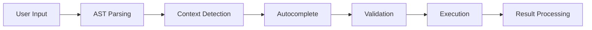

# Advanced SOQL Query Editor

## Table of Contents

- [Overview](#overview)
- [Demo Video](#demo-video)
- [Key Features](#key-features)
  - [Intelligent Autocomplete](#intelligent-autocomplete)
  - [Visual Query Building](#visual-query-building)
  - [Query Management](#query-management)
  - [Advanced Result Display](#advanced-result-display)
- [Technical Architecture](#technical-architecture)
  - [Query Processing Engine](#query-processing-engine)
  - [Core Components](#core-components)
- [Feature Documentation](#feature-documentation)
  - [Smart Autocomplete System](#1-smart-autocomplete-system)
  - [Drag-and-Drop Query Building](#2-drag-and-drop-query-building)
  - [Saved Queries Management](#3-saved-queries-management)
  - [Advanced Result Display](#4-advanced-result-display)
- [Performance Metrics](#performance-metrics)
- [Security and Permissions](#security-and-permissions)
- [Best Practices](#best-practices)
- [Troubleshooting](#troubleshooting)

## Overview

The Advanced SOQL Query Editor is DataPilot's flagship query development interface that revolutionizes SOQL development with intelligent code assistance, visual query building, and comprehensive result management.

## Demo Video

## Key Features

### Intelligent Autocomplete
- **5-Level Autocomplete**: Keywords → SObjects → Fields → Relationships → Nested Subqueries
- **AST-Based Context Detection**: Smart cursor position analysis
- **Smart Subquery Generation**: Automatic subquery creation for relationships
- **Syntax Highlighting**: Advanced SOQL syntax coloring
- **Query Formatting**: Professional SOQL formatting
- **Undo/Redo**: Full history tracking with Ctrl+Z/Ctrl+Y

### Visual Query Building
- **SObject Tree Integration**: Drag fields and objects from schema tree
- **Schema Canvas Integration**: Bidirectional workflow between editor and visual graph
- **Query-to-Graph Conversion**: Convert SOQL queries to interactive visual graphs
- **Field-Level Drag-and-Drop**: Drag specific fields directly into queries
- **SObject Drag-and-Drop**: Drag complete SObjects to build query structure
- **Relationship Traversal**: Automatic detection of child relationships

### Query Management
- **Saved Queries System**: Save, load, and organize queries with metadata
- **Favorites System**: Mark important queries for quick access
- **Tag System**: Categorize queries with custom tags
- **Execution Tracking**: Monitor query usage and performance
- **Import/Export**: File operations for query sharing

### Advanced Result Display
- **Multi-Level Hierarchical Display**: Up to 4 levels of nested detail records
- **Relationship Badges**: 12 color-coded badges for different relationship types
- **Expandable Detail Records**: Interactive expansion of master-detail relationships
- **Dynamic Column Management**: Automatic column width calculation
- **Pagination System**: Configurable page sizes (10, 25, 50, 100)
- **Export Capabilities**: JSON export with attribute cleaning

## Technical Architecture

### Query Processing Engine

### Core Components
- **Query Editor**: Advanced SOQL code editor with syntax highlighting
- **Autocomplete Engine**: Salesforce metadata integration with 5-level intelligence
- **Validation Service**: Real-time syntax and semantic validation
- **Result Processor**: Multi-hierarchy result display with export capabilities

## Feature Documentation

### 1. Smart Autocomplete System

#### Autocomplete Levels

**Level 1: Basic SOQL Keywords**
- SOQL Keywords: SELECT, FROM, WHERE, AND, OR, NOT, IN, LIKE, IS, NULL
- Clause Keywords: ORDER BY, GROUP BY, HAVING, LIMIT, OFFSET, DISTINCT
- Aggregate Functions: COUNT, SUM, AVG, MAX, MIN
- Date Functions: TODAY, YESTERDAY, TOMORROW, THIS_WEEK, LAST_WEEK

**Level 2: SObject Context Detection**
- SObject Suggestions: Intelligent completion for FROM clause
- Context Detection: Uses AST parsing to detect cursor position
- Partial Matching: Filters SObjects based on partial input
- Metadata Integration: Real-time SObject list from Salesforce

**Level 3: Field-Level Autocomplete**
- Field Suggestions: Context-aware field completion based on current SObject
- Field Types: Different handling for regular fields vs reference fields
- Reference Fields: Automatic subquery generation for lookup/master-detail fields
- Type Information: Field type, description, and metadata display

**Level 4: Relationship Traversal**
- Child Relationships: Automatic detection of child relationships
- Subquery Generation: Smart subquery creation for relationships
- Nested Context: Context-aware suggestions within subqueries
- Relationship Names: Uses actual Salesforce relationship names

**Level 5: Nested Subquery Intelligence**
- Nesting Level Detection: Tracks depth of nested subqueries
- Context Preservation: Maintains parent SObject context in nested queries
- Cross-Level References: Suggests fields from parent SObjects
- Complex Relationships: Handles multi-level relationship traversal

### 2. Drag-and-Drop Query Building

#### SObject Tree Integration
- **Field-Level Drag-and-Drop**: Drag specific fields from SObject tree directly into queries
- **SObject Drag-and-Drop**: Drag complete SObjects to automatically build query structure
- **Relationship Detection**: Automatic detection of relationships between SObjects
- **Smart Query Building**: Intelligent query construction based on dropped elements
- **Visual Feedback**: Real-time visual indicators during drag operations

#### Schema Canvas Integration
- **Query-to-Graph Conversion**: Convert SOQL queries to interactive visual graphs
- **Graph-to-Query Conversion**: Modify graphs and convert back to SOQL queries
- **Visual Query Modification**: Edit queries using visual graph interface
- **Real-time Synchronization**: Changes in canvas reflect in query editor
- **AST-Based Processing**: Shared AST state between editor and canvas

### 3. Saved Queries Management

#### Query Card Structure
- **Unique Identifier**: saved_queries_uuid for database operations
- **Connection Context**: connection_uuid linking to specific Salesforce connection
- **Query Metadata**: name, query_text, description, and tags for organization
- **Usage Tracking**: execution_count and last_executed timestamp
- **Favorites System**: is_favorite boolean with star-based marking
- **Timestamps**: created_at and updated_at for version control

#### Management Features
- **Save Queries**: Save current editor content with metadata
- **Load Queries**: One-click loading into editor
- **Delete Queries**: Remove unwanted queries
- **Favorite System**: Mark important queries for quick access
- **Tag System**: Categorize queries with custom tags
- **Execution Tracking**: Monitor query usage and performance

### 4. Advanced Result Display

#### Multi-Level Hierarchical Display
- **Level 1**: Master records with primary data
- **Level 2**: Detail records from master relationships
- **Level 3**: Detail records from level 2 details
- **Level 4**: Detail records from level 3 details
- **Nested Expansion**: Interactive expansion system for each level
- **Relationship Detection**: Automatic detection of master-detail relationships

#### Relationship Badges and Color Schemes
- **Color-Coded Badges**: 12 predefined color schemes for different relationship types
- **Interactive Badges**: Clickable badges showing relationship counts
- **Dynamic Color Assignment**: Automatic color assignment based on relationship type
- **Visual Hierarchy**: Clear visual distinction between different relationship levels

#### DataTable Integration
- **Mantine DataTable**: Professional table component with advanced features
- **Dynamic Column Management**: Automatic column width calculation based on content
- **Resizable Columns**: User-adjustable column widths with persistence
- **Sorting and Filtering**: Built-in sorting and filtering capabilities
- **Row Selection**: Multi-row selection with bulk operations

#### Export Capabilities
- **JSON Export**: Export query results in JSON format
- **Attribute Cleaning**: Automatic removal of Salesforce attributes
- **Data Sanitization**: Clean data export without internal metadata
- **File Naming**: Automatic filename generation with timestamps

## Performance Metrics
- **Load Time**: < 2 seconds
- **Autocomplete**: < 200ms
- **Query Execution**: < 1 second (simple), < 5 seconds (complex)
- **UI Performance**: 60fps animations, < 100ms render time

## Security and Permissions
- **Salesforce Permissions**: Respects object and field-level security
- **Query Encryption**: Encrypted storage and transmission
- **Access Logging**: Complete audit trail
- **Permission Validation**: Real-time permission checking

## Best Practices
- **Use Autocomplete** for accurate field and object names
- **Leverage Drag-and-Drop** for visual query building
- **Use Specific Fields** rather than SELECT *
- **Save Important Queries** with descriptive names and tags

## Troubleshooting
- **Slow Autocomplete**: Check network connectivity and schema cache
- **Drag-and-Drop Issues**: Verify SObject tree connection
- **Query Execution Errors**: Check Salesforce permissions and object access
- **Syntax Highlighting**: Refresh editor or clear cache

---

*This documentation provides comprehensive guidance for using the Advanced SOQL Query Editor feature.*